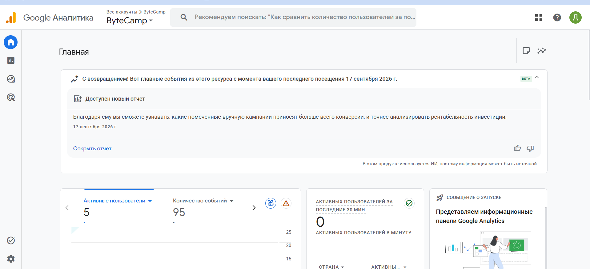
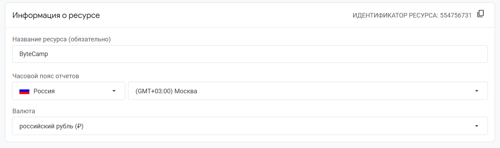
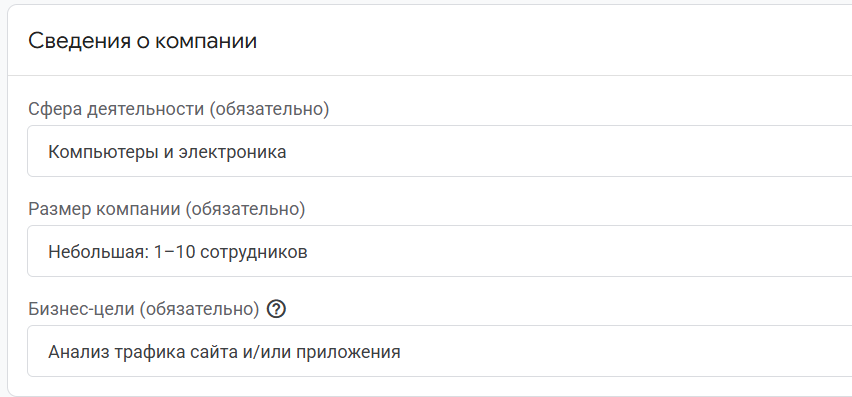
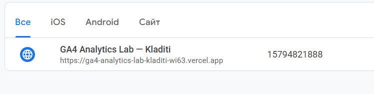

# Домашняя работа № 2 · Где бизнес теряет клиентов

**Дисциплина:** ОП.03 «Информационные технологии»

| Поле | Значение |
|---|---|
| Фамилия, имя, отчество | Кладити Дмитрий |
| Группа | 11/1-РПО-26/1 |
| Номер работы | 2 |
| Тема работы | Анализ воронки цифрового продукта и структура Google Analytics 4 |
| Дата сдачи | 20.09.2026 |
| Ветка | `hw-02` |

---

# Часть 1. Исследование воронки

## 1.1. Объект исследования

| Поле | Значение |
|---|---|
| Компания, сервис или отрасль | Компания Lamoda (продаже одежды, обуви, аксесуаров ) |
| Адрес сайта или приложения | https://www.lamoda.ru |
| Целевое действие | Продажа товаров пользователям |
| Почему выбран этот объект | Достаточно большая цифровая комапания с большим количеством этапов в воронке |

## 1.2. Воронка

От 4 до 7 этапов, по порядку.

| № | Этап | Что считается переходом дальше | Метрика этапа |
|---|---|---|---|
| 1 | Заход на сайт / Переход из рекламы | Переход в каталог или клик по карточке товара | Bounce Rate |
| 2 | Просмотр карточки товара | Нажатие кнопки «Добавить в корзину» | Add-to-Cart Rate |
| 3 | Корзина с выбранными товарами | Нажатие кнопки «Перейти к оформлению» | Cart-to-Checkout Rate |
| 4 | Ввод данных доставки и выбор оплаты | Заполнение формы и переход к оплате | Checkout Completion Rate |
| 5 | Оплата и подтверждение заказа | Успешный перевод средств и переход на экран, что следует после | Order Conversion Rate |

## 1.3. Источники

### Источник 1

| Поле | Значение |
|---|---|
| Название материала | Как за год вырастить персонализацию на главной: эволюция рекомендаций в fashion ecom |
| Автор или организация | Lamoda Seller Academy |
| Дата публикации | 05.09.2025 |
| Прямая ссылка | https://habr.com/ru/companies/lamoda/articles/943272/ |

**Выписка из материала** ключевая мысль:

В результате теста новой персонализированной главной страницы Lamoda получила прирост конверсии добавления в корзину и покупку.

**Что подтверждает и как связано с моей воронкой** (своими словами):

Источник показывает, что изменения на этапе просмотр карточки товара могут влиять не только на добавление товара в корзину, но и на конечную покупку. 

**Цифры из источника и этап воронки, к которому относятся:**

+1,2% - конверсия добавления в корзину.
+1,1% - конверсия в покупку.
Этапы: просмотр товаров → корзина → покупка.

### Источник 2

| Поле | Значение |
|---|---|
| Название материала | Почему покупатели бросают корзины в интернет-магазинах: исследование RetailCRM и ЮKassaа |
| Автор или организация | Яна Сонина / RetailCRM |
| Дата публикации | 04.09.2024 |
| Прямая ссылка | https://www.retailcrm.ru/blog/posts/issledovanie-o-broshennoy-korzine |

**Выписка из материала:**

Исследование показало, что покупатели оставляют в корзине одежду и обувь. Среди причин отказа от покупки: не подходят сроки доставки, необходимость регистрации на сайте, сомнения в безопасности оплаты. 

**Что подтверждает и как связано с моей воронкой:**

Источник показывает, что наличие товара в корзине ещё не гарантирует, что пользователь перейдёт к оформлению заказа. Покупатели отваливаются на этом этаппе варонки.

**Цифры из источника и этап воронки:**

18% - одежда и обувь среди товаров в брошенных корзинах.
17% - бросают корзину из-за неподходящих сроков доставки.
8% - из-за необходимости регистрации.
6% - из-за сомнений в безопасности оплаты.
30% - используют корзину как список желаний.
Этапы: корзина, оформление заказа, оплата.

### Источник 3

| Поле | Значение |
|---|---|
| Название материала | Что проверить, если покупатели интернет-магазина бросают корзины |
| Автор или организация | Яндекс Директ |
| Дата публикации | 29.07.2025 |
| Прямая ссылка | https://www.direct.yandex.ru/base/articles/chto-proverit-esli-pokupateli-internet-magazina-brosayut-korziny |

**Выписка из материала:**

По приведённой Яндексом статистике, клиенты интернет-магазинов не завершают заказы в 70% случаев. Среди причин называются неожиданные дополнительные расходы, сложный и долгий процесс оформления, недостаток вариантов оплаты и доставки, сомнения в надёжности магазина и отвлекающие факторы.

**Что подтверждает и как связано с моей воронкой:**

Источник подтверждает, что один из самых больших участков потери пользователей находится между оформлением товара и завершением заказа. 

**Цифры из источника и этап воронки:**

70% - доля заказов, которые не завершаются на этапе ниже корзины.
Этап: оформление, оплата.

### Источник 4

| Поле | Значение |
|---|---|
| Название материала | Каждая вторая брошенная корзина становилась заказом — данные RetailCRM |
| Автор или организация | RetailCRM |
| Дата публикации | 15.05.2026 |
| Прямая ссылка | https://www.retail.ru/rbc/pressreleases/kazhdaya-vtoraya-broshennaya-korzina-stanovitsya-zakazom-dannye-retailcrm/ |

**Выписка из материала:**

По данным RetailCRM, количество корзин со статусом «брошено» в России выросла в I квартале 2026 года. При этом конверсия из брошенной корзины в заказ составила 46%. Средний срок от брошенной корзины до оформления заказа сократился с 7 дней до 2 дней.

**Что подтверждает и как связано с моей воронкой:**

Источник показывает, что большое количество пользователей может не оформить заказ сразу после добавления товара в корзину. При этом часть таких пользователей возвращается и совершает покупку позже.

**Цифры из источника и этап воронки:**

88% - доля брошенных корзин, I кв. 2026.
46% - конверсия из брошенной корзины в заказ.
2 - 7 дней - средний срок от брошенной корзины до заказа.
Этап: корзина → оформление заказа.

### Источник 5

| Поле | Значение |
|---|---|
| Название материала | Итоги 4 квартала и всего 2024 года в российском e-commerce |
| Автор или организация | PIM Solutions, Ольга Сатановская |
| Дата публикации | 21.01.2025 |
| Прямая ссылка | https://pimsolutions.ru/pim-smi-publications-articles/ecom/itogi-4-kvartala-i-vsego-2024-goda-v-rossijskom-e-commerce.html |

**Выписка из материала:**

Источник выделяет четыре показателя: средний чек, долю предоплаты, сроки доставки и выкуп. По итогам 2024 года доля предоплаченных заказов составила 64,1%. Также источник отмечает, что потребители реагируют на рост цен сокращением своих корзин и поиском более дешёвых альтернатив.

**Что подтверждает и как связано с моей воронкой:**

Источник показывает, что после оформления заказа поведение пользователя всё ещё можно анализировать по дополнительным показателям: способу оплаты, срокам доставки и факту выкупа.  Сроки доставки и выкуп позволяют оценивать результат уже после оформления заказа.

**Цифры из источника и этап воронки:**

Более 67 млн заказов - объём данных исследования.
64,1% - доля предоплаченных заказов в 2024 году.
Этап: ввод данных доставки и выбор оплаты, оплата, подтверждение заказа.

## 1.4. Реальные кейсы

Не менее двух, российские компании или российский рынок. Каждый разбирается по семи пунктам.

### Кейс 1

| № | Пункт | Ответ |
|---|---|---|
| 1 | Интернет-магазин SimpleWine |
| 2 | Как выглядела воронка или её проблемный участок | Корзина - Страница оформления заказа |
| 3 | В чём заключалась проблема | Высокий процент отвала пользователей на этапе чек-аута из-за перегруженной формы оформления и неудобного интерфейса. |
| 4 | Какие данные или наблюдения подтвердили проблему | CX-исследование (проверка взаимодействия полььзователя на всех этапах). |
| 5 | Что изменили или протестировали | Была создана онлайн-витрина с более простымсервисом заказа, также добавили авторизацию по SMS для более простой ригестрации. |
| 6 | Как изменился результат | Конверсия на этапе checkout была увеличена. Точное числовое значение не приведено. |
| 7 | Переносим ли подход на мой объект | Для Lamoda можно аналогично провести CX-исследование и найти места потерь клиентов. |

**Ссылка на источник кейса:**

> https://aic.ru/storage/files/f048b795-2a11-4083-b7bd-e1dea83c588c/%D0%BF%D1%80%D0%BE%D1%84%D0%B0%D0%B8%CC%86%D0%BB-aic-2022.pdf

### Кейс 2

| № | Пункт | Ответ |
|---|---|---|
| 1 | Компания, продукт или рынок | Интернет-магазин женской одежды «МодаСтиль». |
| 2 | Как выглядела воронка или её проблемный участок | Основные проблемы находились на этапах просмотра каталога и карточек товаров, а также в корзине, на мобильных устройствах. |
| 3 | В чём заключалась проблема | Каталог был недостаточно структурирован, а пользователям было сложно найти нужный размер. Исходная конверсия составляла 0,9%, доля брошенных корзин — 68%. |
| 4 | Какие данные или наблюдения подтвердили проблему | Провели UX-исследование (исследование удобства интерфейса) с использованием аналитики. |
| 5 | Что изменили или протестировали | Переработали дизайн, каталог и карточки товаров, добавили большие фотографии, таблицу размеров и отзывы, а также оптимизировали мобильную версию. |
| 6 | Как изменился результат | Конверсия выросла с 0,9% до 1,3% (+45%). Доля брошенных корзин снизилась с 68% до 52%. Средний чек вырос на 18%, мобильная конверсия — на 60%, а показатель отказов снизился на 25%. |
| 7 | Переносим ли подход на мой объект | Нет. Подобный подход можно протестировать на Lamoda, однако у них нет проблем с неудобным интерфейсом.  |

**Ссылка на источник кейса:**

> https://opencart-cms.ru/cases/redizajn-odezhda-konversiya/

## 1.5. Причины потери пользователей

Не менее трёх. Каждая опирается на найденные материалы.

| № | Этап воронки | Причина потери | Какой источник это подтверждает |
|---|---|---|---|
| 1 | Этап 2 (Просмотр карточки) | Пользователь может не перейти к покупке, если на этапе выбора товара ему не хватает персонализации и подходящих рекомендаций. | Источник 1 исследование Lamoda. |
| 2 | Этап 3 и 4 (Корзина / Оформление) | Пользователь может бросить корзину из-за неподходящих сроков доставки, необходимости регистрации или сомнений в безопасности оплаты. | Источник 2/3 исследование RetailCRM и ЮKassa. |
| 3 | Этап 4 и 5 (Оформление / Оплата) | Сложный процесс оформления, дополнительные расходы, недостаточное количество вариантов оплаты и доставки могут приводить к незавершённым заказам. | Источник 4 - исследование Яндекс |

## 1.6. Гипотезы улучшения

Не менее трёх, собственные.

| № | Этап | Гипотеза | Какие данные нужно собрать | Как проверить, сработало |
|---|---|---|---|---|
| 1 | Этап 2 | Если добавить на карточку товара виджет быстрого подбора размера и отзывы с фото от покупателей, то конверсия в добавление товара в корзину (Add-to-Cart Rate) вырастет. | Просмотры карточек товаров, клики по таблице размеров и виджету подбора размера, просмотры отзывов, количество кликов «В корзину» по типам товаров. | Сравнить прирост оформления товаров до и после нововведени. |
| 2 | Этап 5 | Если вывести кнопки быстрой оплаты, то общая конверсия воронки вырастет, так как пользователю не потребуется вручную вводить данные банковской карты. | Доля заказов по типам оплаты, количество нажатий на кнопки быстрой оплаты, доля успешных платежей, количество ошибок при оплате, время от начала оплаты до её завершения, отказ от оформления просле требования подключения карточки. | Прповерить количество оплат после введения озможности платить через систему быстрых платежей. |
| 3 | Этап 4 | Если внедрить оформление заказа в один экран с автозаполнением адреса по подсказкам, то checkout вырастет, так как пользователю потребуется меньше действий для завершения оформления заказа. | Время заполнения формы checkout, количество начатых и завершённых оформлений, количество пользователей, покинувших страницу на этапе ввода адреса. | Замерить время заполнения оформления до и после нововведений. |

# Часть 2. Google Analytics 4

## 2.1. Пройденные шаги

| № | Шаг | Выполнено |
|---|---|---|
| 1 | Вход в Google Analytics под своим аккаунтом | да |
| 2 | Создан Analytics Account | да |
| 3 | Создан Property | да |
| 4 | Выбраны часовой пояс, валюта и общие сведения | да |
| 5 | Выбраны бизнес-цели | да |
| 6 | Создан ресурс | да |
| 7 | Создан Web Data Stream | да |
| 8 | Проверены Website URL, Stream name, Enhanced Measurement | да |
| 9 | Поток создан | да |
| 10 | Найден Measurement ID | да |

## 2.2. Что получилось

| Поле | Значение |
|---|---|
| Analytics Account | ByteCamp |
| Property | ByteCamp |
| Reporting time zone | Россия, Москва (GMT+03:00) |
| Currency | Российский рубль (RUB) |
| Выбранные бизнес-цели | Анализ трафика сайта и/или приложения |
| Stream name | GA4 Analytics Lab — Kladiti |
| Website URL | https://ga4-analytics-lab-kladiti-wi63.vercel.app |
| Stream ID (числовой) | 15794821888 |
| Measurement ID (`G-…`) | G-27HDMDLRS1 |
| Enhanced Measurement | включено |

Stream ID и Measurement ID — это разные идентификаторы. На сайт в задании 3
ставится второй, вида `G-XXXXXXXXXX`.

## 2.3. Скриншоты

Скриншот: вставьте строку 

Скриншот: вставьте строку 

Скриншот: вставьте строку 

Скриншот: вставьте строку 

Скриншот: вставьте строку 

---

## Использование ИИ

Источники вы ищете, читаете и проверяете сами, настройку проходите тоже
сами. ИИ допускается для поиска идей, структурирования и проверки
формулировок, но источником он не считается.

| Вопрос | Ответ |
|---|---|
| Что сделано самостоятельно |  |
| Что спрошено у модели | Просьба найти исследования для источников и кейсов с приведенными числами, касаемо воронки |
| Что после этого проверено и изменено | Не пришлось тратить время на прочтение исследований, где была только теоритическая информация, без приведенных цифр |
