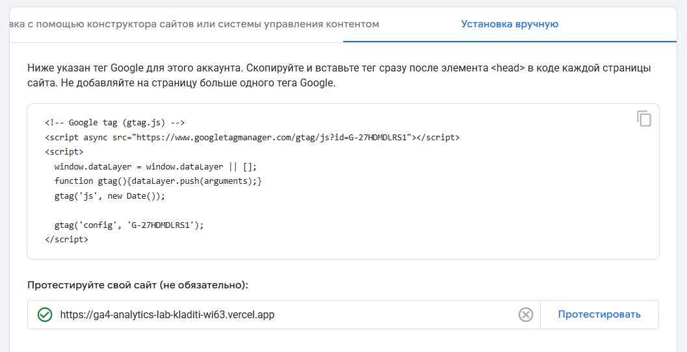
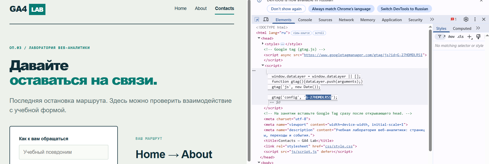
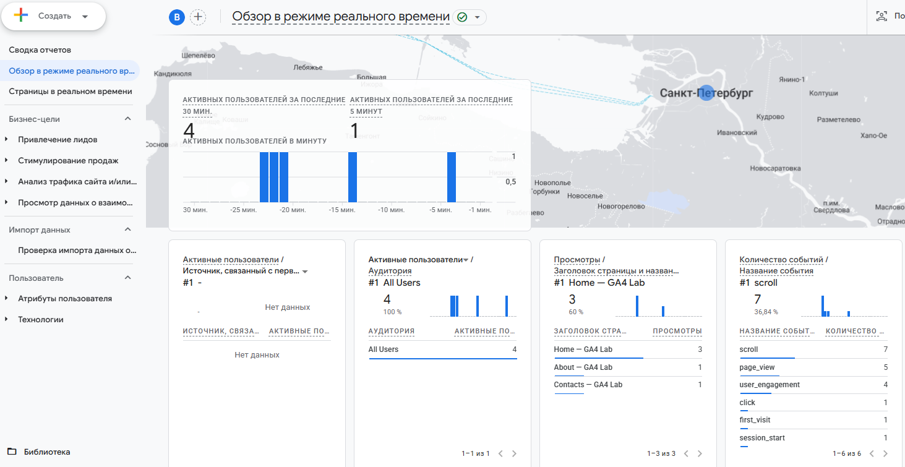
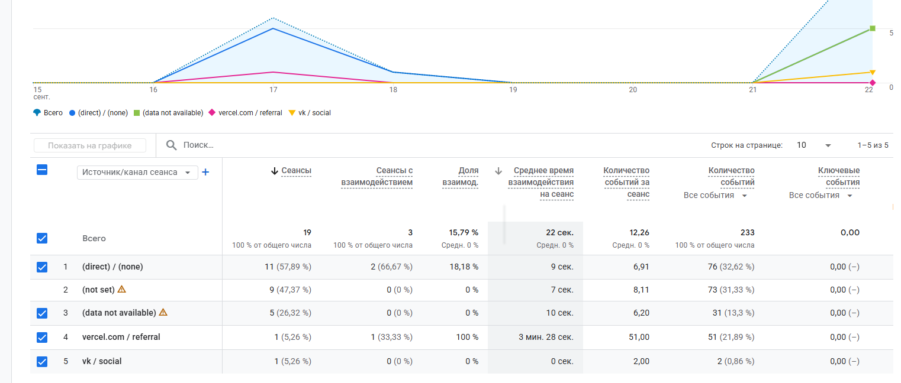
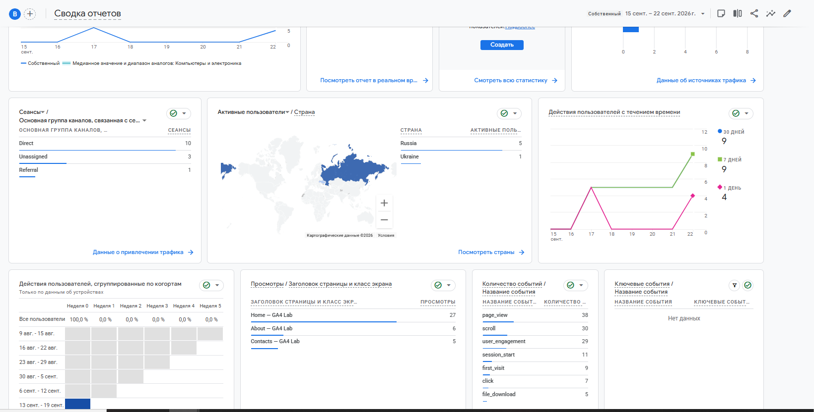

# Домашняя работа № 3 · Тег на сайте, источник и отчёты GA4

**Дисциплина:** ОП.03 «Информационные технологии»

| Поле | Значение |
|---|---|
| Фамилия, имя, отчество | Кладити Дмитрий |
| Группа | 11/1-РПО-26/1 |
| Номер работы | 3 |
| Тема работы | Установка Google Tag, источник перехода и отчёты GA4 |
| Дата сдачи | 22.09.2026 |
| Ветка | `hw-03` |

---

## 1. Мой сайт и мой ресурс

| Поле | Значение |
|---|---|
| Адрес репозитория сайта | https://github.com/DmitriyKladiti/ga4-analytics-lab-Kladiti |
| Публичный адрес сайта | https://ga4-analytics-lab-kladiti-wi63.vercel.app/ |
| Статус публикации | READY |
| Analytics Account | ByteCamp |
| Property | ByteCamp |
| Stream name | GA4 Analytics Lab — Kladiti |
| Website URL в потоке | https://ga4-analytics-lab-kladiti-wi63.vercel.app/ |
| Measurement ID (`G-…`) | G-27HDMDLRS1 |
| Страницы с тегом | Home, About, Contacts |

## 2. Тег установлен

**Результат проверки из инструкции тега:**

>

Скриншот: Сообщение об обнаружении тега Google 

Во вкладке "Сведения о веб-потоке" висит предупреждениие о том, что 
сбор данных не работает, однако данные фиксируются и тестирование выдает зеленую галочку.

Скриншот: Код тега на странице, виден Measurement 

## 3. События доходят до аналитики

| Поле | Значение |
|---|---|
| Дата и время проверки | 22.09.2026 19:45 |
| Какие страницы открывали | Home, About, Contacts |
| Какие события появились в Realtime | scroll, page_view, user_engagement, click, first_visit, session_start |
| Число активных пользователей в момент проверки | 4 |

Скриншот: Realtime с событием page_view 

## 4. Источник перехода определился

Ссылка собирается с метками `utm_source`, `utm_medium`, `utm_campaign`
и открывается на своём сайте.

**Ссылка целиком:**

```
https://ga4-analytics-lab-kladiti-wi63.vercel.app/?utm_source=vk&utm_medium=social&utm_campaign=ga4_lab
```

| Поле | Значение |
|---|---|
| Где в GA4 виден источник | Привлечение трафика: Источник/канал сеанса
 |
| Какое значение источника показал GA4 | vk / social
 |
| Совпадает с `utm_source` из ссылки | да |

Скриншот: Источник перехода в GA4  

Источник и кампания из UTM в отчёте Realtime не показываются: эти измерения
вычисляются при обработке данных. Если в Realtime источника нет, смотрите
отчёт по источникам трафика в разделе «Отчёты».

## 5. Статистика на странице «Отчёты»

| Показатель | Значение | Период |
|---|---|---|
| Пользователи | 9 | Последние 7 дней |
| Сеансы | 11 | Последние 7 дней |
| События | 130 | Последние 7 дней |
| Самое частое событие | page_view | Последние 7 дней |

Скриншот: Страница «Отчёты» со статистикой 

**Что видно по этим числам** (2–3 предложения):

При условии реального пользования сайтом, эти цифры покажут важную информацию о пользователях и то, как именно они использовали сайт. Самым частыс событием сейчас является загрузка страницы, это говорит о том, чаще всего "пользователи" изучабт сайт, переходя на разные страницы.

## 6. Что не получилось

Если какой-то шаг не заработал, напишите какой, какое сообщение показал сервис
и что было проверено по таблице из `README.md`. Незаполненный раздел означает,
что всё получилось.

>

## 7. Использование ИИ

Тег вы устанавливаете, проверяете и снимаете кадры сами. ИИ допускается
для формулировок и оформления.

| Вопрос | Ответ |
|---|---|
| Что сделано самостоятельно | Почти вся эта работа была сделанна в аудитории, дома нужно было лишь собрать скрины и оформить |
| Что спрошено у модели | Почему не повлялся источник в привлечении трафика |
| Что после этого изменено | Модель сказала, что это нормально и нужно подождать денек, я подождал и все появилось! |
