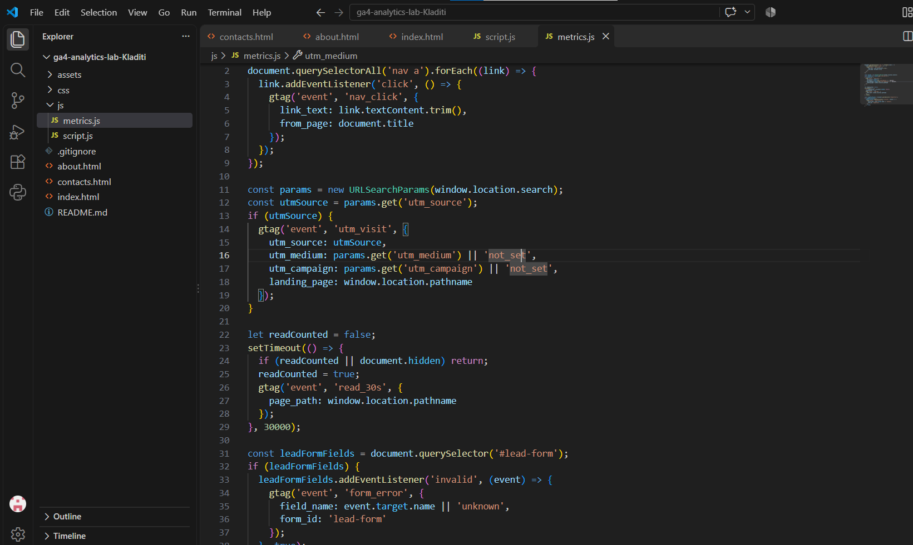
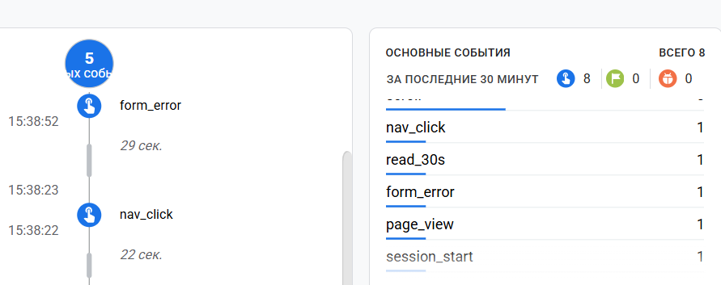
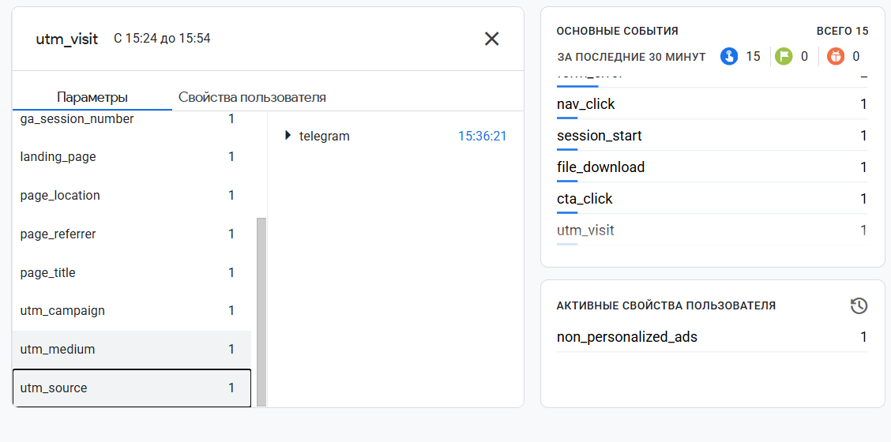
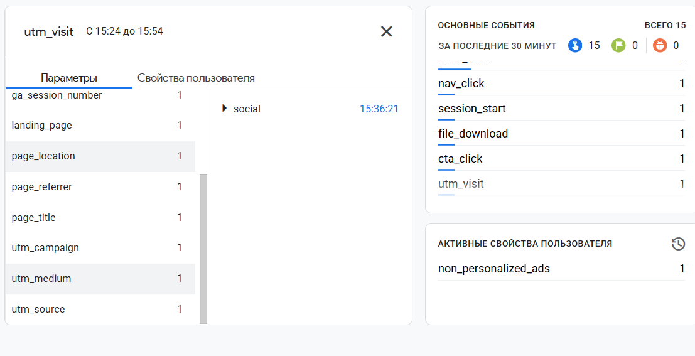
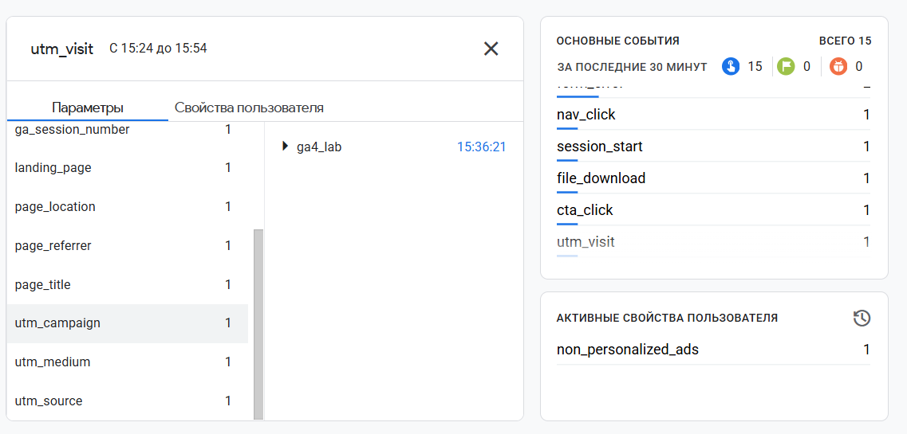
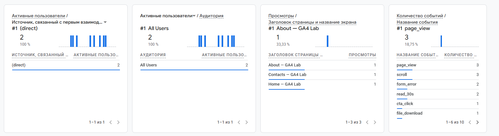

# Домашняя работа № 4 · Свои события и параметры в GA4

**Дисциплина:** ОП.03 «Информационные технологии»

| Поле | Значение |
|---|---|
| Фамилия, имя, отчество | Кладити Дмитрий |
| Группа | 11/1-РПО-26/1 |
| Номер работы | 4 |
| Тема работы | Свои события и параметры в GA4 |
| Дата сдачи | 30.09.2026 |
| Ветка | `hw-04` |

---

## 1. Мой сайт и мой ресурс

| Поле | Значение |
|---|---|
| Публичный адрес сайта | https://ga4-analytics-lab-kladiti-wi63.vercel.app/ |
| Measurement ID (`G-…`) | G-27HDMDLRS1 |
| Коммит с метриками (ссылка или первые 7 символов) | https://github.com/DmitriyKladiti/ga4-analytics-lab-Kladiti/commit/0711d8cd99b29011a81382781f95904ae3ac673a |
| Статус публикации | READY |
| Страницы, где подключён `js/metrics.js` | about.html contacts.html index.html |

Файл подключается после основного скрипта и на каждой странице по одному
разу: два подключения дают двойные события.

## 2. Какие метрики добавлены

| Событие | Что измеряет | Что делали, чтобы оно сработало |
|---|---|---|
| `nav_click` | клики по пунктам меню | переходил с одной страницы на другую |
| `utm_visit` | метки кампании из адреса | вписал в ссылке метки |
| `read_30s` | полминуты на странице | долистал страницу и подождал 30 секунд |
| `form_error` | форма не прошла проверку браузера | не заполнял поле с именем и отправил |

Скриншот: Файл metrics.js в проекте и строка подключения 

## 3. События в DebugView

| Поле | Значение |
|---|---|
| Дата и время проверки | 30.09.2026 15:35 |
| Как подключали отладку | Tag Assistant / `debug_mode` |
| Какие из четырёх событий пришли | Пришли все |
| Какие не пришли и почему | Пришли все |

Скриншот: Лента DebugView с новыми событиями 

## 4. Параметры события `utm_visit`

**Ссылка, по которой открывали сайт:**

```
https://ga4-analytics-lab-kladiti-wi63.vercel.app/?utm_source=telegram&utm_medium=social&utm_campaign=ga4_lab
```

| Параметр | Значение в ссылке | Значение в GA4 |
|---|---|---|
| `utm_source` | telegram | telegram |
| `utm_medium` | social | social |
| `utm_campaign` | ga4_lab | ga4_lab |
| `landing_page` | — | - |

Скриншот: Раскрытое событие utm_visit со значениями меток 



## 5. Событие вне отладки

| Поле | Значение |
|---|---|
| Где проверяли | Realtime |
| Какое событие искали | read_30s |
| Сколько срабатываний показал экран | 2 |
| Период (для отчёта) | с 15:35 до 16:05 |

Скриншот: Событие в Realtime или в отчёте за период 

## 6. Что эти метрики показывают про сайт

По метрике read_30s можно понять, тратит ли пользователь временя на изучение функционала сайта, если это событие не пришло, то можно предположить, что пользователь покинул сайт не разобравшись. form_error покажет как много раз пользователи не могут отправить форму в правильном виде. nav_click может сказать, какие разделы сайта интересуют посетителей больше всего. utm_visit показывает, из какого источника пришёл посетитель, - это помогает понять, какая рекламная площадка или канал дают болше трафика. 

>

## 7. Что не получилось

Вроде, получилось все.

>

## 8. Использование ИИ

Скрипты метрик выданы готовыми. Подключение, проверку и кадры вы делаете
сами. ИИ допускается для формулировок и оформления.

| Вопрос | Ответ |
|---|---|
| Что сделано самостоятельно | почти все |
| Что спрошено у модели | "берите готовые скрипты, кладите файл в папку js/ своего сайта и подключайте на всех страницах после основного скрипта" - не сразу понял, что это значит. Думал имеется ввиду конец файла |
| Что после этого изменено | поставил блоки кода в правильное место |
